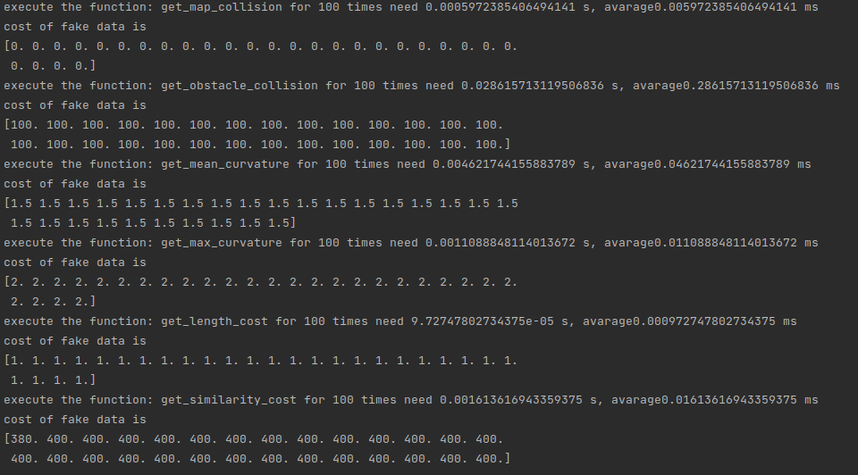
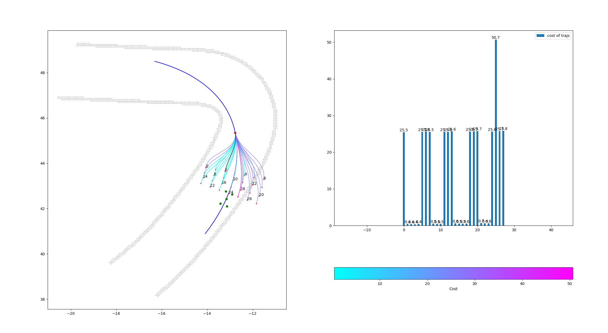

## 2022/06/17

- Overview

Add cost functions.

Add time test (using 28 trajs), visualize test for correctness.

Use uniform weights(1/n) for testing, some time crash/hit the opponent in the map, but the current cost function should be correct.  

- Current cost function and time cost

**Note:** 

*get_obstacle_collision* use some hardcoding for get_vertices func to speed up

*use njit:* get_map_collision, get_obstacle_collision, get_length_cost

all the cost functions grouping the traj as input, *traj: np.ndarray, (n, m, 5), traj_clothoid: np.ndarray, (n, 6)*

- Visualize test result

**Left fig:** 

the optimal(with minimum cost) traj is label in red idx and black trajectory points.

the green points are the opponents 

**Right fig:**

cost for each trajectory

- Current TODO

adjust the velocity for the trajectory points(generate different v for the same traj?)

what if all the trajs are blocked by an opponent(the opponent is too close to the car)?

